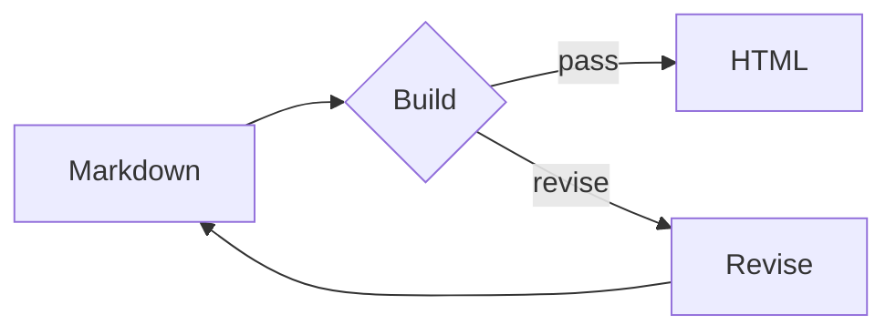

# 402v HTML Note Kit

`402v HTML Note Kit` turns a compact Markdown note into a polished standalone HTML file. The output uses the same core design tokens as 402v, opens directly from disk, and can be published unchanged through the existing 402v HTML publisher.

## Quick Start

Create a starter:

```bash
npm run html:note -- init /tmp/agent-memory-system --title "Agent Memory System"
```

Build it:

```bash
npm run html:note -- build /tmp/agent-memory-system/note.md
```

The output is `/tmp/agent-memory-system/note.html`.

Use `--output <path>` to choose another output file. Existing files are protected; add `--force` only when replacement is intentional.

## 402v Theme And Layout Contract

Generated notes use the same base contract as the live 402v publishing system:

- dark grid background and `#15171b` panel surfaces;
- purple action accent, green ready/success state, and warm warning state;
- monospace brand, paths, status badges, metadata, and code;
- system sans-serif body copy for longer reading;
- `1200px` outer container, `8px` panels, and `10px` gaps;
- sticky 402v top bar;
- one hero/status panel;
- one content grid with a primary reading panel and a `240–280px` information rail;
- single-column responsive collapse below tablet width.

These rules make locally opened notes and top-level `/posts/<slug>` HTML artifacts feel like the same product even though the published artifact owns the full browser viewport.

## Authoring Model

- HTML is the primary reading, archive, and publishing artifact.
- Markdown is an optional convenient input for people and agents.
- There is no required JSON source file.
- The tool does not impose a canonical-source or edit-prohibition rule.

Supported content includes headings, paragraphs, emphasis, links, images, lists, task lists, quotes/callouts, GFM tables, fenced code, and flow diagrams.

Frontmatter is optional:

```markdown
---
title: Agent Memory System
description: One source, many reading surfaces.
eyebrow: 402v Knowledge
lang: zh-CN
---
```

## Flow Diagrams

Use a Mermaid-compatible v1 subset:

````markdown

````

Supported directions are `LR` and `TD`. Supported nodes are:

- `A[Box]`
- `B{Decision}`
- `C(Pill)`
- labeled arrows such as `A -->|pass| B`

Diagrams render to inline SVG during the build, so the final HTML has no Mermaid runtime or network dependency.

## Images

Relative and absolute local PNG, JPEG, GIF, WebP, AVIF, and SVG files are embedded as data URIs. Missing files, unsupported formats, and files larger than 10 MB fail the build with a clear error. Remote HTTP images remain remote.

## Publish To 402v

After reviewing the generated file, use the existing publisher:

```bash
npm run publish:html -- \
  --input /tmp/agent-memory-system/note.html \
  --title "Agent Memory System" \
  --slug agent-memory-system \
  --author-id <admin-user-id> \
  --visibility private \
  --dry-run
```

Remove `--dry-run` and add `--publish` only when the publishing action is authorized.
