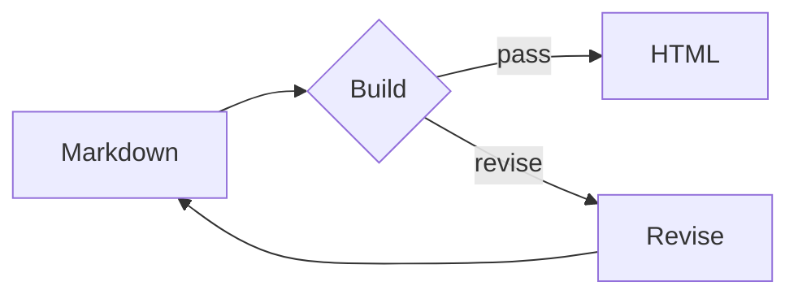

# 402v HTML Note Kit

`402v HTML Note Kit` compiles polished standalone HTML in two modes: the existing Markdown note workflow and an opt-in, manifest-driven interactive artifact workflow. Both outputs use the same core design tokens as 402v, open directly from disk, and can be published unchanged through the existing 402v HTML publisher.

## Quick Start

Create a starter:

```bash
npm run html:note -- init /tmp/agent-memory-system --title "Agent Memory System"
```

Build it:

```bash
npm run html:note -- build /tmp/agent-memory-system/note.md
```

The output is `/tmp/agent-memory-system/note.html`.

Use `--output <path>` to choose another output file. Existing files are protected; add `--force` only when replacement is intentional.

## 402v Theme And Layout Contract

Generated notes use the same base contract as the live 402v publishing system:

- dark grid background and `#15171b` panel surfaces;
- purple action accent, green ready/success state, and warm warning state;
- monospace brand, paths, status badges, metadata, and code;
- system sans-serif body copy for longer reading;
- `1200px` outer container, `8px` panels, and `10px` gaps;
- sticky 402v top bar;
- one hero/status panel;
- one content grid with a primary reading panel and a `240–280px` information rail;
- single-column responsive collapse below tablet width.

These rules make locally opened notes and top-level `/posts/<slug>` HTML artifacts feel like the same product even though the published artifact owns the full browser viewport.

## Authoring Model

- HTML is the primary reading, archive, and publishing artifact.
- Markdown is an optional convenient input for people and agents.
- There is no required JSON source file.
- The tool does not impose a canonical-source or edit-prohibition rule.

Supported content includes headings, paragraphs, emphasis, links, images, lists, task lists, quotes/callouts, GFM tables, fenced code, and flow diagrams.

Frontmatter is optional:

```markdown
---
title: Agent Memory System
description: One source, many reading surfaces.
eyebrow: 402v Knowledge
lang: zh-CN
---
```

## Flow Diagrams

Use a Mermaid-compatible v1 subset:

````markdown

````

Supported directions are `LR` and `TD`. Supported nodes are:

- `A[Box]`
- `B{Decision}`
- `C(Pill)`
- labeled arrows such as `A -->|pass| B`

Diagrams render to inline SVG during the build, so the final HTML has no Mermaid runtime or network dependency.

## Images

Relative and absolute local PNG, JPEG, GIF, WebP, AVIF, and SVG files are embedded as data URIs. Missing files, unsupported formats, and files larger than 10 MB fail the build with a clear error. Remote HTTP images remain remote.

## Interactive Artifact Quick Start

Interactive artifacts are declared by a trusted local ESM manifest. A complete contract-version-1 manifest looks like this:

```js
export default {
  contractVersion: 1,
  mode: "interactive",
  rootDirectory: ".",
  metadata: {
    title: "Project Index",
    description: "A standalone interactive artifact.",
    eyebrow: "402v System",
    lang: "en",
  },
  dataBlocks: [
    { id: "project-registry", source: "./data/projects.json" },
  ],
  renderer: "./renderer.mjs",
  styles: ["./artifact.css"],
  scripts: ["./artifact.js"],
  svgAssets: [
    {
      id: "system-map",
      source: "./system-map.svg",
      title: "Artifact compilation pipeline",
      description: "Canonical JSON flows through renderer slots into offline HTML.",
    },
  ],
  requiredDataBlocks: ["project-registry"],
};
```

Build and verify it:

```bash
npm run html:note -- build-artifact ./artifact.mjs --output ./artifact.html
npm run html:note -- verify ./artifact.html --required-block project-registry
```

`verify` executes deliberately included artifact JavaScript as trusted local code during its bounded startup check. It is not a sandbox for untrusted or third-party scripts.

Rebuild the visual shell while preserving every canonical block already embedded in an artifact:

```bash
npm run html:note -- build-artifact ./artifact.mjs \
  --output ./artifact.html \
  --preserve-data-from ./artifact.html \
  --force
```

Replace one named block from strict UTF-8 JSON:

```bash
npm run html:note -- update-data ./artifact.html \
  --manifest ./artifact.mjs \
  --id project-registry \
  --input ./replacement-projects.json
```

An in-place `update-data` replaces the source artifact atomically without requiring `--force`. An explicit different `--output` remains no-clobber by default; add `--force` to replace that destination intentionally. `build-artifact` also protects existing destinations unless `--force` is present.

The complete CLI surface is:

```text
html-note-kit init <directory> --title <title> [--force]
html-note-kit build <input.md> [--output <output.html>] [--force]
html-note-kit build-artifact <manifest.mjs> [--output <output.html>] [--preserve-data-from <artifact.html>] [--force]
html-note-kit update-data <artifact.html> --manifest <manifest.mjs> --id <block-id> --input <data.json> [--output <output.html>] [--force]
html-note-kit verify <artifact.html> [--required-block <block-id>]...
```

The three interactive commands write exactly one JSON object to stdout on success and exactly one structured error object to stderr on failure. Manifest and renderer output cannot corrupt those machine-readable streams because consumer execution runs in an isolated worker.

## Manifest And Renderer Contracts

`contractVersion` must be `1` and `mode` must be `"interactive"`. `rootDirectory` is optional and defaults to the manifest directory; when present it must be a relative directory beneath the manifest directory. All declared files remain beneath that trusted root after real-path resolution.

All four metadata strings are required. `dataBlocks` declares unique addressable JSON IDs and local sources. `renderer` names one local ESM renderer. `styles`, `scripts`, and `svgAssets` are explicit local-entry arrays; each SVG definition has an ID and source plus optional title and description. `requiredDataBlocks` may only name declared blocks and is enforced during verification. Empty asset arrays are valid.

Manifest and renderer files are single-file ESM modules in contract version 1. Static imports, dynamic imports, and dependency re-exports are unsupported. The renderer exports one function and receives detached, deeply frozen canonical data, prepared SVG assets, and metadata:

```js
export function renderArtifact({ data, svg, metadata }) {
  return {
    navigation: '<a href="#projects">Projects</a>',
    heroSupplementary: `<p>${data["project-registry"].projects.length} projects</p>`,
    mainSections: '<section id="projects">...</section>',
    rail: svg["system-map"].html,
    footer: `<p>${metadata.title}</p>`,
  };
}
```

Every slot is optional, but only these five string slots are accepted:

- `navigation`: top bar, after the artifact path;
- `heroSupplementary`: hero, after the status metadata;
- `mainSections`: primary content panel;
- `rail`: information rail;
- `footer`: immediately before the Kit signature.

Slot HTML is trusted local markup, but it cannot escape its fixed parent, add scripts, or reuse a canonical data-block ID. The renderer may display canonical values; it must not declare a second machine-readable data source.

Consumer scripts run after the JSON blocks and the Kit runtime. Read data through the frozen browser API rather than duplicating a project array or other canonical value:

```js
const registry = window.__402vArtifact.getData("project-registry");
const ids = window.__402vArtifact.dataIds();
const root = window.__402vArtifact.root;
```

## Programmatic API

The supported module surface contains exactly five functions:

```js
import {
  buildNote,
  buildInteractiveArtifact,
  updateArtifactData,
  verifyArtifact,
  extractDataBlocks,
} from "./lib/html-note-kit/index.mjs";

await buildNote({
  inputPath: "./note.md",
  outputPath: "./note.html",
  force: false,
});

await buildInteractiveArtifact({
  manifestPath: "./artifact.mjs",
  outputPath: "./artifact.html",
  preserveDataFrom: "./previous.html",
  force: true,
  verifyDeterminism: true,
});

await updateArtifactData({
  artifactPath: "./artifact.html",
  manifestPath: "./artifact.mjs",
  id: "project-registry",
  value: { projects: [] },
});

verifyArtifact({
  path: "./artifact.html",
  requiredDataBlocks: ["project-registry"],
});

const blocks = extractDataBlocks(html);
```

`verifyArtifact` accepts exactly one of `path` or an HTML string in `html`; advanced callers may also set `startupTimeoutMs` from 10 to 10,000 ms. Interactive build and update determinism checks default to enabled. `updateArtifactData` defaults to in-place replacement; an explicit alternate output can use `force: false` for no-clobber behavior.

## Canonical Data And Output Guarantees

JSON blocks are the only machine-readable declarations in an interactive artifact. Object keys are sorted recursively, array order is preserved, unsafe script-closing characters are escaped, and the emitted block remains strict JSON. IDs match `[A-Za-z][A-Za-z0-9_.:-]{0,127}`. The embedded `402v-source-hash` is a SHA-256 hash of the complete canonical block map; build results also report source and output SHA-256 hashes.

Interactive builds render twice by default and reject byte differences. Output contains no timestamp, random ID, absolute path, or machine-specific value. The complete HTML is verified in memory before a same-directory temporary file is flushed and renamed. Failed parsing, rendering, determinism, verification, or writing leaves an absent destination absent and an existing destination byte-identical when filesystem rollback succeeds; a rollback failure is returned as a structured error rather than hidden. No-clobber writes remain race-safe, including dangling symlinks.

`--preserve-data-from` overlays every verified source block on manifest data, including extra block IDs no longer declared by the manifest. `update-data` reads and verifies one artifact snapshot, replaces only the requested existing ID, preserves every other block, then performs the same deterministic and atomic rebuild.

## Trust, Offline Assets, And Resource Limits

Manifest modules, renderers, slot HTML, CSS, and JavaScript are trusted local consumer code. Contract version 1 does not sandbox untrusted or third-party plugins. The Kit constrains paths, module shape, resources, document structure, and output; consumers remain responsible for the behavior of code they deliberately include.

Interactive output is one UTF-8 HTML file with no required server, package runtime, stylesheet, font, image, iframe, or network request. Asset restrictions are deliberately narrow:

- JavaScript entries are classic scripts. Imports, dynamic imports, source-map URLs, raw script markers, and invalid syntax are rejected.
- CSS entries reject `@import`, remote URLs, and unresolved local dependencies. Only data and fragment URLs are accepted.
- SVG rejects declarations/entities, scripts, embedded HTML, event attributes, external or unresolved references, and active resource elements. Every SVG needs a `viewBox`, an accessible title, and a Kit-owned horizontal-scroll frame.

Current bounded inputs are:

- at most 32 data blocks, 16 stylesheet entries, 16 script entries, and 16 SVG assets;
- 16 MiB per JSON source, 32 MiB aggregate raw JSON, 250,000 canonical JSON nodes, and maximum JSON depth 256;
- 2 MiB per manifest, renderer, stylesheet, or JavaScript file; 5 MiB per SVG;
- 8 MiB aggregate CSS, 8 MiB aggregate JavaScript, and 20 MiB aggregate SVG;
- 5,000 SVG elements and SVG depth 256;
- 4 MiB per renderer slot and 8 MiB across all slots;
- 64 MiB maximum generated HTML artifact size in both note and interactive modes;
- an 8-second default isolated startup check, configurable up to 10 seconds, plus a 30-second CLI worker limit and 1 MiB bounded worker diagnostics.

## Generic Interactive Fixture

[`fixtures/html-note-kit-interactive/`](../../fixtures/html-note-kit-interactive/) is a reusable, schema-neutral example. It builds three generic projects from one `project-registry` block, renders all five slots, inlines local CSS and an accessible wide compilation-pipeline SVG, and filters the rendered cards through `window.__402vArtifact.getData` while opened directly from disk. The wide pipeline demonstrates that only its `.artifact-svg-frame` scrolls horizontally at desktop and mobile widths; its labels describe Kit stages rather than duplicating registry values.

The fixture is an example consumer, not a Kit feature. The Kit does not implement consumer schemas, search behavior, projection rules, domain transactions, publishing policy, or an Orchestrator migration. Those remain consumer responsibilities.

## Publish To 402v

After reviewing the generated file, use the existing publisher:

```bash
npm run publish:html -- \
  --input /tmp/agent-memory-system/note.html \
  --title "Agent Memory System" \
  --slug agent-memory-system \
  --author-id <admin-user-id> \
  --visibility private \
  --dry-run
```

Remove `--dry-run` and add `--publish` only when the publishing action is authorized.
